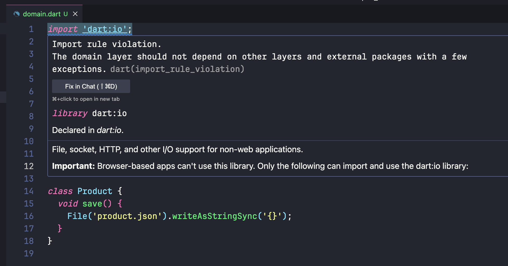
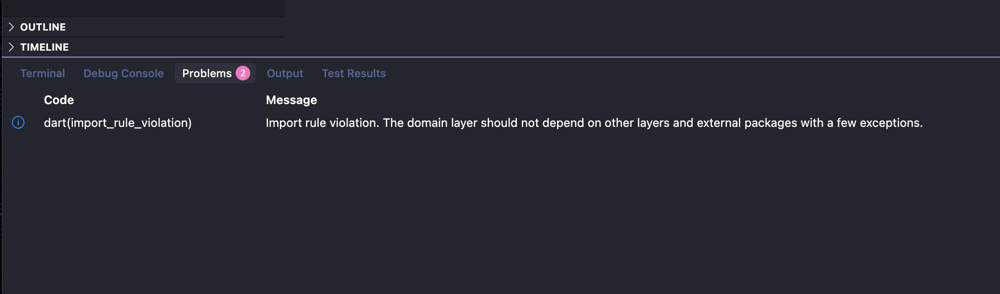

# import_rules

A [lint plugin for the Dart analyzer](https://dart.dev/tools/analyzer-plugins) that enforces custom import rules in your projects. Control which files can import which other files using simple YAML configuration, enabling everything from simple allow/disallow lists to complex module dependency constraints for architectural patterns such as layered architecture, feature isolation, and encapsulation.

> [!IMPORTANT]
> Dart SDK 3.10.0+ (Flutter SDK 3.38.0+) is required to enable Dart analyzer plguins.

## Getting started

### 1. Install plugin

Add `import_rules` to the top-level `plugins` section of your `analaysis_options.yaml`. You don't need to add the plugin to the dependencies in `pubspec.yaml`.

```yaml
plugins:
  import_rules: ^<latest-version> # e.g., ^0.0.1
```

### 2. Define rules

The import rules are defined either in the top-level `import_rules` section of `analysis_options.yaml` or in the top-level `import_rules.yaml` file (the same directory as `analysis_options.yaml`). See [RULES_FILE_SPEC.md](RULES_FILE_SPEC.md) for more details about the rule syntax, or see the [Case studies](#case-studies) section for practical use cases.

```yaml
# analysis_options.yaml

plugins:
  ...

import_rules:
  rules:
    - reason: |
        The domain layer should not depend on other layers
        and external packages with a few exceptions.
      target: lib/domain/**
      disallow: "**"
      exclude_disallow:
        - lib/domain/**
        - package:uuid/uuid.dart
        - dart:collection
        - dart:math
```

```yaml
# import_rules.yaml

rules:
  - reason: |
      The domain layer should not depend on other layers
      and external packages with a few exceptions.
    target: lib/domain/**
    ...
```

### 3. Analyze your code

The plugin and rules are automatically loaded when the dart analysis server starts, for example, when you run `dart analyze` in console or launch your IDE. Just like other lint rules, you can see the lint errors in the output of `dart analyze` or in dedicated places within the IDE, such as VSCode's "Problems" panel.

> [!NOTE]
> For IDEs, you may need to restart the analysis server to apply new configurations after modifying the rule file. For VSCode, open the Command Palette and run either `Developer: Reload Window` or `Dart: Restart Analysis Server`. This workaround is expected to be removed in a future release (see issue [#4](https://github.com/fujidaiti/import_rules/issues/4)).




## Case studies

Here's a list of practical use cases for the plugin.

### Keep domain layer pure

In a layered architecture, the domain layer should remain free from external dependencies to maintain purity and testability. Only specific, carefully chosen packages (like UUID generators or core Dart libraries) should be allowed as exceptions.

```file tree
lib/
  domain/
    domain.dart
    src/entity.dart
  repository/
    repository.dart
    user_repository.dart
    product_repository.dart
```

```import_rules.yaml
rules:
  - target: lib/domain/**
    disallow: "**"
    exclude_disallow:
      - lib/domain/**
      - package:uuid/uuid.dart
      - dart:collection
      - dart:math
    reason: |
      The domain layer should not depend on other layers
      and external packages with a few exceptions.
```

### Downward dependency only

Enforce that files can only import from the same directory level or deeper, preventing upward dependencies. This creates a clear dependency hierarchy where higher-level directories cannot depend on lower-level ones.

```file tree
lib/
  main.dart
  features/
    features.dart
    auth/
      auth.dart
      auth_utils.dart
    cart/
      cart.dart
```

```import_rules.yaml
rules:
  - target: "**"
    disallow: "**"
    exclude_disallow: "$TARGET_DIR/**"
    reason: Files can only import from same or deeper directory levels.
```

### Force uni-directional layer dependencies

In a layerd architecture, the layers should have uni-directional dependencies, where the lower layers can not depend on the higher layers.
For example, say we have 4 layers: domain, persistence, application, and presentation. Sice the domain layers is the lowest layer, it should not depend on the other layers. The persistence layer can depend on the domain layer. The application layer orchestrates business logic, so it can depend on the persistence layer. The presentation layer displays the data, so it should depend only on the application layer.

```file tree
lib/
  domain/
  persistence/
  application/
  presentation/
```

```import_rules.yaml
rules:
  - target: lib/domain/**
    disallow: lib/**
    exclude_disallow: lib/domain/**
    reason: Domain layer should not depend on other layers.

  - target: lib/persistence/**
    disallow:
      - lib/application/**
      - lib/presentation/**
    reason: Persistence layer can not depend on application and presentation layers.

  - target: lib/application/**
    disallow: lib/presentation/**
    reason: Application layer can not depend on presentation layer.
    
  - target: lib/presentation/**
    disallow:
      - lib/persistence/**
      - lib/domain/**
    reason: Presentation layer should depend only on application layer.
```

### Feature module isolation

In a feature-driven architecture, each feature should be isolated from the other features. The only exception is the "core" module, which can be shared between features.

```file tree
lib/
  features/
    core/
    auth/
    profile/
```

```import_rules.yaml
rules:
  - target: lib/features/**
    disallow: lib/features/**
    exclude_disallow:
      - $TARGET_DIR/** # Allow internal dependencies within the same feature.
      - lib/features/core/**
    reason: Features should be isolated from each other except the core module.
```

### Thrid package wrapper enforcement

Enforce use of wrappers for third-party packages instead of directly importing them. For example, say we are using "http" package for network requests. When we have our own wrapper for the "http" package, called "http_wrapper", we should use it instead of directly importing the "http" package.

```file tree
lib/
  core/
    http_wrapper.dart
  api/
    user_api.dart
    product_api.dart
```

```import_rules.yaml
rules:
  - target: lib/**
    exclude_target: lib/core/http_wrapper.dart
    disallow: package:http/**
    reason: Use lib/core/http_wrapper.dart instead of directly importing the "http" package.
```

### Legacy code deprecation

A long lived application may have some legacy code that is no longer actively developed, but still used by the other parts of the codebase because it is in the middle of the migration to a new architecture, or for some backward compatibility reasons. Newly added features, however, should not depend on such legacy code.

```file tree
lib/
  features/
    auth/ # New auth module
    profile/ # Still depends on legacy auth module
    feed/ # newly added module
    legacy/
      auth/ # Legacy auth module 
```

```import_rules.yaml
rules:
  - target: lib/features/**
    exclude_target:
      - lib/features/legacy/** # Legacy code can depend on other legacy code.
      - lib/features/profile/** # Profile module is still using legacy code.
    disallow: lib/features/legacy/**
    reason: Newly added features should not depend on legacy code.
```

### Forbid IO operations in unit testing

In unit testing, we don't want to perform any IO operations.

```file tree
lib/
  main.dart
test/
  unit/
    domain_test.dart
```

```import_rules.yaml
rules:
  - target: test/unit/**
    disallow: dart:io
```

### Prefer aggregate file imports over individual file imports

An aggregate file is a file that controls which components (classes, functions, etc.) defined in the sub directories can be visible from the outside. An aggregate file, which is typically named as the same as the parent directory, would look like this:

```lib/domain/domain.dart
// All public components in entiry.dart can be visible from the outside.
export 'src/entity.dart';

// Only Value class can be visible from the outside.
export 'value.dart' show Value;
```

To make the aggregate file work, we need to forbid importing the individual files directly. For example, we should allow `import 'domain/domain.dart';` but disallow `import 'domain/entity.dart';` and `import 'domain/value.dart';` in the outside of the domain module.

```file tree
lib/
  main.dart
  application/
    application.dart
  domain/
    domain.dart
    value.dart
    src/entity.dart
```

```import_rules.yaml
rules:
  - target: lib/**
    exclude_target: lib/domain/**
    disallow: lib/domain/**
    exclude_disallow: lib/domain/domain.dart
    reason: Import "domain/domain.dart" instead of directly importing "domain/**/*.dart".
```

### Implementation detail encapsulation

Say, our team has a naming convention for Dart files where the name of an implementation file should have a prfix of an underscore. The implementation files are files that are stemmed from splitting a large file into smaller ones for readability and maintainability, but should not be visible from the outside (similar to `part` and `part of` keywords). Because of this reason, such implementation files should be imported only from the same directory.

```file tree
lib/
  main.dart
  cache/
    cache.dart
    _cache_file_loader.dart
    _cache_table.dart
    _cache_hash_algorithm.dart
    utils/
      utils.dart
```

With the above file tree, the only file that can import `_cache_*.dart` files should be `lib/cache/cache.dart`. The other files including `lib/cache/utils/utils.dart` should not be able to import `_cache_*.dart` files because they are not in the same directory as the implementation files.

```import_rules.yaml
rules:
  - target: lib/**
    disallow: _*.dart
    # Allow to depend on implementation files within the same directory.
    exclude_disallow: $TARGET_DIR/_*.dart 
    reason: Implementation files should not be imported directly.
```

### Always use the prefix 'math' for dart:math

When using the `dart:math` library, we should always use the prefix 'math' for the imports.

```import_rules.yaml
rules:
  - target: "**"
    disallow: dart:math
    exclude_disallow: { path: dart:math, as: math }
    reason: Always use the prefix 'math' for dart:math.
```

```dart
import 'dart:math'; // Not allowed
import 'dart:math' as m; // Not allowed
import 'dart:math' as math; // Allowed
```

### Enforce the use of custom logger instead of built-in log function

Instead of using the built-in `log` function from `dart:developer`, we should use a custom logger.

```import_rules.yaml
rules:
  - target: "**"
    exclude_target: lib/common/logger.dart
    disallow: dart:developer
    exclude_disallow: { path: dart:developer, hide: logger }
    reason: |
      Always use lib/common/logger.dart instead of the built-in log function. 
      If you need to import dart:developer, try hiding the log function from the import.
```

```dart
import 'dart:developer'; // Not allowed
import 'dart:developer' as dev; // Not allowed
import 'dart:developer' hide log; // Allowed
```

```dart
// lib/common/logger.dart

import 'dart:developer';

class Logger {
  void info(String message) {
    log('[$DateTime.now().toIso8601String()] $message');
  }
}
```
