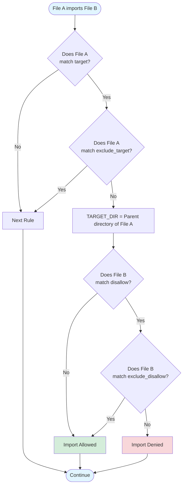

# import_rules

A Dart analyzer plugin that enforces custom import rules in your projects. Control which files can import which other files using simple YAML configuration, enabling architectural patterns like layered architecture, feature isolation, and encapsulation.

## Features

- **Flexible rule definitions** using glob patterns
- **Architecture enforcement** for layered, feature-based, and modular codebases
- **$TARGET_DIR variable** for directory-relative rules
- **Multiple configuration locations** (dedicated config file or `analysis_options.yaml`)
- **Clear error messages** with custom reason explanations
- **Zero runtime overhead** - analysis happens at development time

## Installation

### 1. Add the plugin as a dev dependency

Add `import_rules` to your `pubspec.yaml`:

```yaml
dev_dependencies:
  import_rules: ^0.0.1
```

Run:

```bash
dart pub get
```

### 2. Enable the plugin in analysis_options.yaml

Add the following to your `analysis_options.yaml`:

```yaml
analyzer:
  plugins:
    - import_rules
```

### 3. Create your import rules

Create an `import_rules.yaml` file in your project root (or add rules to `analysis_options.yaml` under an `import_rules:` section).

### 4. Run the analyzer

```bash
dart analyze
```

The plugin will check all import statements against your configured rules and report violations.

## Configuration

You can define rules in two ways:

**Option 1: Dedicated config file** (recommended)

Create `import_rules.yaml` in your project root:

```yaml
rules:
  - name: Keep domain layer pure
    reason: Domain layer should not depend on other layers
    target: lib/domain/**
    disallow: lib/**
    exclude_disallow: lib/domain/**
```

**Option 2: In analysis_options.yaml**

Add rules under an `import_rules:` section:

```yaml
analyzer:
  plugins:
    - import_rules

import_rules:
  rules:
    - name: Keep domain layer pure
      reason: Domain layer should not depend on other layers
      target: lib/domain/**
      disallow: lib/**
      exclude_disallow: lib/domain/**
```

### Rule Fields

Each rule has the following fields:

```yaml
rules:
  - name: Optional rule name            # Used in error messages
    reason: Why this rule exists        # Required - explains the rule
    target: lib/domain/**               # Required - files to apply rule to
    exclude_target: lib/domain/test/**  # Optional - exceptions to target
    disallow: lib/**                    # Required - imports to disallow
    exclude_disallow: lib/domain/**     # Optional - exceptions to disallow
```

**Multiple values:** Use array syntax for multiple patterns:

```yaml
rules:
  - name: Layer isolation
    reason: Enforce layered architecture
    target:
      - lib/presentation/**
      - lib/ui/**
    disallow:
      - lib/data/**
      - lib/domain/**
```

### Field Descriptions

| Field | Required | Description |
|-------|----------|-------------|
| `name` | Optional | Rule identifier shown in error messages |
| `reason` | **Required** | Human-readable explanation of why this rule exists |
| `target` | **Required** | Glob patterns matching files that this rule applies to |
| `exclude_target` | Optional | Patterns to exclude from `target` matches |
| `disallow` | **Required** | Patterns matching imports that are not allowed |
| `exclude_disallow` | Optional | Patterns to exclude from `disallow` (making them allowed) |

## Pattern Syntax

### Glob Patterns

Rules use glob patterns to match files. Patterns work with both relative file paths and package imports.

**Wildcards:**

| Pattern | Matches | Example |
|---------|---------|---------|
| `*` | Any characters within a single directory level | `lib/*.dart` matches `lib/main.dart` but not `lib/src/utils.dart` |
| `**` | Any number of directory levels | `lib/**` matches all files under `lib/` |
| `?` | Any single character | `lib/?.dart` matches `lib/a.dart`, `lib/b.dart` |

**Examples:**

```yaml
# Match all files in presentation layer
target: lib/presentation/**

# Match specific file types in any feature
target: lib/features/*/models/*.dart

# Match test files
target: test/**_test.dart

# Match external package imports
disallow: package:http/**

# Match Dart core libraries
disallow: dart:io
```

### The $TARGET_DIR Variable

`$TARGET_DIR` is a special variable that represents the parent directory of the file being checked. It enables directory-relative rules.

**Where to use it:**

- In `disallow` patterns
- In `exclude_disallow` patterns
- Cannot be used in `target` or `exclude_target`

**How it works:**

When a file matches `target`, `$TARGET_DIR` is set to that file's parent directory path.

**Example 1: Files can only import from their own directory**

```yaml
rules:
  - target: "**"
    disallow: "**/src/**"
    exclude_disallow: "$TARGET_DIR/**"
    reason: src/ files are implementation details, only importable within same directory
```

For file `lib/features/auth/src/utils.dart`:

- `$TARGET_DIR` becomes `lib/features/auth/src`
- Can import from `lib/features/auth/src/**` (same directory)
- Cannot import from `lib/features/profile/src/**` (different src directory)

**Example 2: Encapsulate implementation files**

```yaml
rules:
  - target: "**"
    disallow: "**/_*.dart"
    exclude_disallow: "$TARGET_DIR/_*.dart"
    reason: Files prefixed with underscore are private to their directory
```

For file `lib/cache/cache.dart`:

- `$TARGET_DIR` becomes `lib/cache`
- Can import `lib/cache/_internal.dart` (same directory)
- Cannot import `lib/utils/_helpers.dart` (different directory)

## How Rules Are Evaluated

When you import a file, the plugin checks each rule in order. For each rule:

1. **Does the source file match `target`?** If no, skip this rule
2. **Does the source file match `exclude_target`?** If yes, skip this rule
3. **Extract `$TARGET_DIR`** from the source file's parent directory
4. **Does the import match `disallow`?** If no, allow the import
5. **Does the import match `exclude_disallow`?** If yes, allow the import
6. **Otherwise:** Report a violation with the rule's `reason`

**Visual diagram:**



### Multiple Rules

All rules are evaluated for every import. If **any** rule denies an import, it results in an error.

**Example:**

```yaml
rules:
  - name: No UI in domain
    target: lib/domain/**
    disallow: lib/ui/**
    reason: Domain layer should not depend on UI

  - name: No network in UI
    target: lib/ui/**
    disallow: package:http/**
    reason: UI should not make direct network calls
```

A file in `lib/ui/` importing `package:http/http.dart` will be caught by the second rule, even if the first rule doesn't apply.

## Common Use Cases

### 1. Keep Domain Layer Pure

Prevent external dependencies in your domain layer:

```yaml
rules:
  - name: Pure domain layer
    target: lib/domain/**
    disallow: "**"
    exclude_disallow:
      - lib/domain/**
      - dart:core
      - dart:collection
      - dart:math
      - package:uuid/uuid.dart
    reason: Domain layer should remain free from external dependencies
```

### 2. Enforce Layered Architecture

Create uni-directional dependencies between layers:

```yaml
rules:
  - name: Domain isolation
    target: lib/domain/**
    disallow: lib/**
    exclude_disallow: lib/domain/**
    reason: Domain layer should not depend on other layers

  - name: Data layer boundaries
    target: lib/data/**
    disallow:
      - lib/presentation/**
      - lib/ui/**
    reason: Data layer cannot depend on presentation

  - name: Presentation layer boundaries
    target: lib/presentation/**
    disallow:
      - lib/data/**
      - lib/domain/**
    reason: Presentation should only use application layer
```

### 3. Feature Module Isolation

Keep features independent from each other:

```yaml
rules:
  - name: Feature isolation
    target: lib/features/**
    disallow: lib/features/**
    exclude_disallow:
      - $TARGET_DIR/**
      - lib/features/core/**
    reason: Features should be isolated except for shared core module
```

### 4. Third-Party Package Wrappers

Force usage of custom wrappers instead of direct imports:

```yaml
rules:
  - name: Use HTTP wrapper
    target: lib/**
    exclude_target: lib/core/http_wrapper.dart
    disallow: package:http/**
    reason: Use lib/core/http_wrapper.dart instead of direct http package imports
```

### 5. Implementation Detail Encapsulation

Hide implementation files (prefixed with underscore):

```yaml
rules:
  - name: Private implementation files
    target: "**"
    disallow: "**/_*.dart"
    exclude_disallow: "$TARGET_DIR/_*.dart"
    reason: Files prefixed with _ are private to their directory
```

### 6. Aggregate File Pattern

Force imports through aggregate files:

```yaml
rules:
  - name: Use domain aggregate
    target: lib/**
    exclude_target: lib/domain/**
    disallow: lib/domain/**
    exclude_disallow: lib/domain/domain.dart
    reason: Import domain/domain.dart instead of individual domain files
```

### 7. Prevent IO in Unit Tests

```yaml
rules:
  - name: No IO in unit tests
    target: test/unit/**
    disallow: dart:io
    reason: Unit tests should not perform IO operations
```

### 8. Downward Dependencies Only

Prevent upward dependencies in directory hierarchy:

```yaml
rules:
  - name: Downward dependencies only
    target: "**"
    disallow: "**"
    exclude_disallow: "$TARGET_DIR/**"
    reason: Files can only import from same or deeper directory levels
```

For more examples, see [e2e/USE_CASES.md](e2e/USE_CASES.md).

## Debugging

If rules aren't working as expected, check the plugin logs:

```bash
cat .dart_tool/import_rules/instrumentation_*.log
```

Logs include:

- Loaded rules and their patterns
- File paths being analyzed
- Import URIs and how they're normalized
- Rule evaluation decisions

## Understanding URI Normalization

The plugin normalizes all paths to be consistent, so your rules work regardless of import style:

**Source files:**

- `file:///Users/you/project/lib/main.dart` → `lib/main.dart`
- `package:my_app/src/utils.dart` → `lib/src/utils.dart`

**Import URIs:**

- `import 'package:my_app/main.dart'` → `lib/main.dart` (internal)
- `import '../utils.dart'` → resolved to relative path
- `import 'package:flutter/material.dart'` → `package:flutter/material.dart` (external)
- `import 'dart:io'` → `dart:io` (core library)

This means a rule like `disallow: lib/main.dart` will match both relative imports and package imports of the same file.
