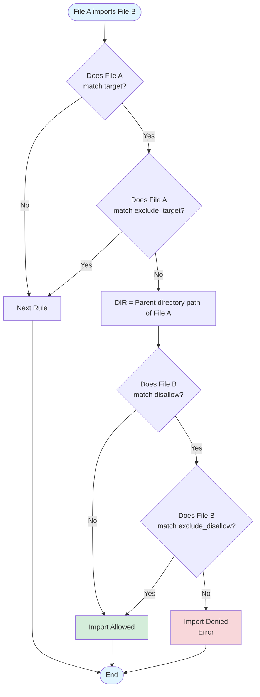

# Dart Import Lint Tool Specification

## 1. Overview

A lint tool for Dart language that controls which files can import which files. Uses YAML for configuration files, enabling flexible rule definitions.

## 2. Configuration File Structure

### 2.1 Basic Structure

```yaml
rules:
  - name: Rule name
    reason: Why this rule exists
    target: pattern
    exclude_target: exception_pattern
    disallow: disallowed_pattern
    exclude_disallow: exception_pattern
```

**For multiple elements, use array format:**

```yaml
rules:
  - name: Rule name
    reason: Why this rule exists
    target:
      - pattern1
      - pattern2
    disallow:
      - disallowed_pattern1
      - disallowed_pattern2
```

### 2.2 Fields

#### `name` (optional)

Rule identifier name. Used in error messages.

#### `reason` (required)

Reason for the rule. Required for developers to understand the intent of the rule.

#### `target` (required)

File patterns to which this rule applies. Use string for single element, array for multiple elements.

```yaml
# Single element
target: lib/presentation/**

# Multiple elements
target:
  - lib/presentation/**
  - lib/ui/**
```

#### `exclude_target` (optional)

File patterns to exclude from `target`. Use string for single element, array for multiple elements.

#### `disallow` (required)

File patterns that files matching `target` cannot import. Use string for single element, array for multiple elements.

#### `exclude_disallow` (optional)

File patterns to exclude from `disallow` (making them importable). Use string for single element, array for multiple elements.

## 3. Pattern Syntax

### 3.1 Glob Pattern

Default pattern notation. Can be written without quotes.

**Syntax:**

- `*` - Any string within a single directory level (does not include `/`)
- `**` - Any directory levels
- `?` - Any single character

**Examples:**

```yaml
target:
  - lib/presentation/**
  - lib/features/*/models/*.dart
  - test/**_test.dart
```

### 3.2 Predefined Variable: $DIR

`$DIR` is a predefined variable representing the `parent directory path of the file matched by target`.

**Where it can be used:**

- `disallow`
- `exclude_disallow`

**Constraints:**

- `$DIR` is automatically determined from the file matched by `target`
- Cannot be used in `target` itself

**Behavior:**

```yaml
target:
  - lib/features/auth/src/utils.dart
```

In this case, `$DIR = lib/features/auth/src`

**Example:**

```yaml
target:
  - "**"
disallow:
  - "**/src/**"
exclude_disallow:
  - "$DIR/**"
```

**Behavior:**

- `lib/features/auth/src/utils.dart` matches → `DIR=lib/features/auth/src`
- `disallow` prohibits all files under `src/`
- `exclude_disallow: lib/features/auth/src/**` → excludes own directory
- Result: Only files within the same `src/` directory can be imported

## 4. Evaluation Rules

### 4.1 Matching Order

1. Check if the file matches the `target` pattern
2. If it matches `exclude_target`, this rule does not apply
3. Check if the imported file matches `disallow`
4. If it matches `exclude_disallow`, the import is allowed

### 4.2 Evaluation Flowchart



### 4.3 Multiple Rules

When multiple rules are defined, all rules are evaluated independently. If any rule prohibits the import, that import results in an error.

## 5. YAML Syntax Notes

### 5.1 Quotation

Quotes are not required except in the following cases:

```yaml
# Quotes not required
target:
  - lib/presentation/**
  - package:flutter/material.dart

# Quotes required (when only **)
disallow:
  - "**"
```

### 5.2 Comments

Standard YAML comment notation can be used.

```yaml
rules:
  # Presentation layer rules
  - name: Presentation isolation
    reason: Keep presentation layer clean
    target:
      - lib/presentation/**
    disallow:
      - lib/data/**  # Direct data access forbidden
```

---

## Appendix: Use Cases

### A1. Layer Architecture Enforcement

**Purpose:** Prohibit presentation layer from directly importing data layer

```yaml
rules:
  - name: Presentation layer isolation
    reason: Presentation layer should not directly import data layer
    target: lib/presentation/**
    disallow: lib/data/**
    exclude_disallow: lib/data/models/**
```

### A2. Core Domain Independence

**Purpose:** Keep core domain independent from framework

```yaml
rules:
  - name: Core independence
    reason: Core domain must remain framework-agnostic
    target: lib/core/**
    disallow:
      - package:flutter/**
      - lib/ui/**
```

### A3. Feature Module Boundaries

**Purpose:** Prohibit direct dependencies between feature modules

```yaml
rules:
  - name: Feature module boundaries
    reason: Features should not cross-import each other
    target: lib/features/auth/**
    disallow:
      - lib/features/profile/**
      - lib/features/settings/**
      - lib/features/cart/**
```

### A4. src Directory Encapsulation

**Purpose:** Apply encapsulation to any directory containing `src/`

```yaml
rules:
  - name: src directory encapsulation
    reason: src/ directories are always private to their parent module
    target: "**"
    disallow: "**/src/**"
    exclude_disallow: "$DIR/**"
```

**Behavior Examples:**

**Case 1: lib/features/auth/auth.dart → lib/features/auth/src/utils.dart**

- `DIR = lib/features/auth`
- `lib/features/auth/src/utils.dart` matches `**/src/**` → prohibited
- `$DIR/**` = `lib/features/auth/**` matches → excluded
- **Result: ✓ (import allowed - same module can access its own src/)**

**Case 2: lib/features/auth/src/cache.dart → lib/features/auth/src/utils.dart**

- `DIR = lib/features/auth/src`
- `lib/features/auth/src/utils.dart` matches `**/src/**` → prohibited
- `$DIR/**` = `lib/features/auth/src/**` matches → excluded
- **Result: ✓ (import allowed)**

**Case 3: lib/core/models/src/entity.dart → lib/core/models/src/value.dart**

- `DIR = lib/core/models/src`
- `lib/core/models/src/value.dart` matches `**/src/**` → prohibited
- `$DIR/**` = `lib/core/models/src/**` matches → excluded
- **Result: ✓ (import allowed)**

**Case 4: lib/infrastructure/db.dart → lib/domain/src/entity.dart**

- `DIR = lib/infrastructure`
- `lib/domain/src/entity.dart` matches `**/src/**` → prohibited
- `$DIR/**` = `lib/infrastructure/**` does not match
- **Result: ✗ (import not allowed)**

This rule automatically encapsulates `src/` directories at any hierarchy level.

### A5. Test Isolation

**Purpose:** Prohibit unit tests from importing integration test utilities

```yaml
rules:
  - name: Test isolation
    reason: Unit tests cannot import integration test utilities
    target: test/unit/**
    disallow: "**"
    exclude_disallow:
      - test/unit/**
      - lib/**
      - package:test/**
      - package:mockito/**
```

### A6. Platform Code Isolation

**Purpose:** Prohibit platform-specific implementations from importing other platform code

```yaml
rules:
  - name: Platform code isolation
    reason: Platform implementations should not cross-import
    target: lib/platform/**
    disallow: lib/platform/**
    exclude_disallow:
      - "$DIR/**"
      - lib/platform/common/**
```

**Behavior Examples:**

- `lib/platform/android/camera.dart` → `lib/platform/android/sensor.dart` ✓
- `lib/platform/ios/camera.dart` → `lib/platform/android/camera.dart` ✗
- `lib/platform/web/storage.dart` → `lib/platform/common/interface.dart` ✓

### A7. Barrel File Pattern

**Purpose:** Force access to internal implementation files through barrel files

```yaml
rules:
  - name: Use barrel files
    reason: Internal files should be accessed via barrel exports
    target: "**"
    exclude_target: lib/features/$DIR/**
    disallow: lib/features/*/internal/**
```

### A8. Deprecated Code Migration

**Purpose:** Prevent new dependencies on deprecated legacy code

```yaml
rules:
  - name: Avoid legacy code
    reason: Legacy modules are deprecated and should not be used in new code
    target: lib/features/**
    exclude_target: lib/features/legacy/**
    disallow: lib/features/legacy/**
```

### A9. Third-party Package Restriction

**Purpose:** Restrict specific package usage and enforce wrapper usage

```yaml
rules:
  - name: Use analytics wrapper
    reason: Direct firebase_analytics usage is forbidden, use our wrapper
    target: lib/**
    exclude_target: lib/core/analytics/**
    disallow: package:firebase_analytics/**
```

### A10. Generated Code Protection

**Purpose:** Restrict imports to prevent direct editing of generated code

```yaml
rules:
  - name: Generated code isolation
    reason: Generated code should not import non-generated code
    target:
      - lib/**.g.dart
      - lib/**.freezed.dart
    disallow: lib/**
    exclude_disallow:
      - lib/**.g.dart
      - lib/**.freezed.dart
      - package:**
```

### A11. Hierarchical Import Restriction

**Purpose:** Files can only import from same or deeper directory levels (prohibit upward dependencies)

```yaml
rules:
  - name: Downward dependency only
    reason: Files can only import from same or deeper directory levels
    target: lib/**
    disallow: "**"
    exclude_disallow: "$DIR/**"
```

**Behavior Examples:**

- `lib/features/auth/auth.dart` → `lib/features/auth/models/user.dart` ✓
- `lib/features/auth/auth.dart` → `lib/features/auth/src/cache.dart` ✓
- `lib/features/auth/auth.dart` → `lib/features/settings/settings.dart` ✗
- `lib/features/auth/auth.dart` → `lib/main.dart` ✗ (upward dependency)
