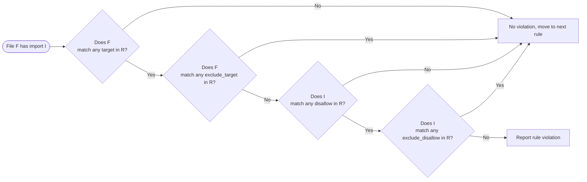

# Rules file specification

The rules are defined either in a part of `analysis_options.yaml` or in a dedicated `import_rules.yaml` under the project root. A rules file would look like the following:

```yaml
# import_rules.yaml

rules:
  # Rule 1
  - target: lib/domain/**
    disallow: lib/**
    exclude_disallow: lib/domain/**
    reason: Domain layer should not depend on other layers.

  # Rule 2
  - target: lib/persistence/**
    disallow:
      - lib/application/**
      - lib/presentation/**
    reason: Persistence layer can not depend on application and presentation layers.
```

Note that if rules are defined in `analysis_options.yaml`, ensure that all the top-level fields such as `rules` are declared in the `import_rules:` section.

```yaml
# analysis_options.yaml

plugins:
 import_rules: ^x.x.x

import_rules:
  rules:
    ...
```

</br>

## Top level fields

Here are the descriptions of the top level fields in the rules file:

| Field | Required | Description |
|-------|----------|-------------|
| `rules` | **Required** | List of [import rule](#import-rule) definitions. |

</br>

## Import rule

An import rule defines which files can import which other files. Each rule is evaluated independently in the definition order. See [How Rules Are Evaluated](#how-rules-are-evaluated) section for more details about the evaluation logic.

| Field             | Required   | Description |
|-------------------|------------|-------------|
| `reason`          | **Required** | Human-readable explanation of why this rule exists. It will be displayed as a lint error message when the rule is violated in the IDE or in the output of `dart analyze`. All leading/trailing whitespaces are removed, and newline characters in the middle are replaced with whitespaces. |
| `target`          | **Required** | A list of [target pattern](#target-pattern)s. If any of the patterns in the list matches the path of a Dart file in the project, the rule is applied to that file and such file is called a **target file**. </br></br> If the list contains only one pattern, it can be specified as a single string instead of a list: `target: lib/**`. |
| `exclude_target`  | Optional   | A list of [target pattern](#target-pattern)s. If the target file matches any of the patterns in the list, the rule is not applied to that file. </br></br> If the list contains only one pattern, it can be specified as a single string instead of a list: `exclude_target: lib/domain/**`. |
| `disallow`        | **Required** | A list of [disallow pattern](#disallow-pattern)s. The plugin tests each of the specified patterns one by one against an import directive of the target file (called an **importee**), and if any of the patterns matches, the plugin reports a rule violation error with the `reason` at that line in the target file. </br></br> If the list contains only one pattern, it can be specified as a single string instead of a list: `disallow: lib/**`. |
| `exclude_disallow`| Optional   | A list of [disallow pattern](#disallow-pattern)s. If the importee was matched any of the `disallow` patterns, but also matched any of the `exclude_disallow` patterns, the target file is exceptionally allowed to import that importee and no error is reported. </br></br> If the list contains only one pattern, it can be specified as a single string instead of a list: `exclude_disallow: lib/domain/**`. |

</br>

## Target pattern

A target pattern is a glob path pattern used to determine which files an import rule applies to. A path pattern must be relative to the project root, and can contain wildcards to match multiple files. See the documentation of [glob](https://pub.dev/packages/glob#syntax) package for more details about the wildcards.

```yaml
# Match a specific Dart file.
target: lib/src/utils.dart

# Match a specific test file.
target: test/widget_test.dart

# Match every file in the project.
target: "**"

# Match all files in "domain" directory.
target: lib/domain/**

# Match all files in "src" directory under any directory, e.g.,
#   - lib/src/utils.dart
#   - lib/domain/src/utils.dart
#   - lib/features/auth/src/common/utils.dart
#
# Note that this doesn't match the top level "src" directory.
target: "**/src/**"

# Match all files with the prefix of "_".
target: _*.dart
```

</br>

## Disallow pattern

A disallow pattern is a URI based [glob](https://pub.dev/packages/glob#syntax) pattern that is tested against import directives of Dart files (called **importee**s). It is similar to target patterns, but it can also contain a scheme and [predefined variables](#predefined-variables). The possible forms of a disallow pattern are: path URI, package URI, or Dart URI.

### Path URI pattern

A path URI pattern is a glob path relative to the project root such as `lib/common/style.dart` and `test/**`. This is pretty much similar to target patterns; for example, `lib/common/style.dart` matches `import 'common/style.dart';`. Due to the [pattern normalization](#pattern-normalization), the pattern `lib/common/style.dart` also matches import directives like `import '../common/style.dart';` and `import '../../common/style.dart';`.

> [!NOTE]
> Currently, disallow patterns ignore optional keywords in import directives such as `as`, `hide`, and `show`. For example, the pattern `lib/common/style.dart` also matches `import 'common/style.dart' as style;`. The same is true for package URI and Dart URI patterns.
>
> A new syntax is planned to be introduced to support more precise matching patterns in a future release (see issue [#3](https://github.com/fujidaiti/import_rules/issues/3)).

### Package URI pattern

A package URI pattern starts with `package` scheme followed by a package name and a glob path relative to `<package root>/lib/`. For example, the pattern `package:http/http.dart` matches `import 'package:http/http.dart';`. Note that patterns where the package name is the same as the project name are [normalized](#pattern-normalization) (e.g., `package:my_project/main.dart`).

### Dart URI pattern

A Dart URI pattern starts with `dart` scheme followed by a module name of the Dart standard library like `dart:async`. For example, `dart:io` matches `import 'dart:io';` and `dart:math` matches `import 'dart:math';`.

</br>

### Wildcards

Just like target patterns, a disallow pattern can also contain wildcards except in the scheme part of the pattern.

```yaml
# Match any importee including those from external packages and the Dart standard libraries.
disallow: "**"

# Match any importee from external packages.
disallow: package:**

# Match any importee from the "flutter" package.
disallow: package:flutter/**

# Match any importee from the Dart standard library.
disallow: dart:*

# Match any importee from the top-level "lib" directory.
disallow: lib/**

# Match any importee from the "src" directory at any level except the top-level "src" directory.
disallow: "**/src/**"

# This pattern also works, but very ambiguous. You don't want to use this.
# It matches any importee for top-level Dart files in the project and any importee from the Dart standard library.
disallow: "*"
```

</br>

### Pattern Normalization

In Dart, we can write import directives for a project file in different ways even though they actually import the same file. For example, the following import directives all refer to `lib/domain/user.dart`:

```dart
import 'package:my_package/domain/user.dart'; // From anywhere in the package
import 'user.dart'; // From the same directory as user.dart
import '../domain/user.dart'; // From lib/persistence/*.dart
import '../../domain/user.dart'; // From lib/features/auth/*.dart
import '../lib/../lib/domain/user.dart'; // Weird, but it works in lib/main.dart
```

Intuitively, we want a single disallow pattern for `lib/domain/user.dart` to match all the above import directives instead of having to write a separate pattern for each possible import directive. For this reason, the plugin normalizes package URI patterns whose package name is the same as the project name to path URI patterns. For example, the pattern `package:my_package/domain/*.dart` is normalized to `lib/domain/*.dart`.

Similarly, the URIs in import directives that point to project files are also normalized to path URIs relative to the project root. For example, the URIs of `import 'package:my_package/domain/user.dart';` and `import '../domain/user.dart';` are both normalized to `lib/domain/user.dart`.

As a result, both of the following disallow patterns are equivalent and match all the above import directives:

```yaml
disallow: lib/domain/**
disallow: package:my_package/domain/**
```

</br>

### Predefined variables

There are several predefined variables that can be referenced in the path part of a disallow pattern with the prefix of `$`. These variables are substituted with actual values at evaluation time. See [How Rules Are Evaluated](#how-rules-are-evaluated) section for more details.

| Variable | Description |
|----------|-------------|
| `TARGET_DIR` | The path to the target file's parent directory, relative to the project root. For example, if the target file is `lib/domain/user.dart`, the pattern `$TARGET_DIR/**` expands to `lib/domain/**` at evaluation time. An example of using this variable can be found in [Case study: Implementation detail encapsulation](README.md#implementation-detail-encapsulation). |

</br>

## How Rules Are Evaluated

When the Dart analyzer asks the plugin to analyze a Dart file `F`, the plugin takes an importee `I` from the file one by one, takes a rule `R` from the rules file one by one, and tests the rule `R` against the pair of `F` and `I` as follows:

1. **Does the path of file `F` match any `target` pattern in rule `R`?** If no, skip this rule.
2. **Does the path of file `F` match any `exclude_target` pattern in rule `R`?** If yes, skip this rule.
3. **Does importee `I` match any `disallow` pattern in rule `R`?** If no, allow the import.
4. **Does importee `I` match any `exclude_disallow` pattern in rule `R`?** If yes, allow the import.

Otherwise, report a rule violation at the line of the importee `I` in the file `F` with the `R.reason` message.



</br>

### Priority of rules

The rules are evaluated in the order they appear in the rules file, that is, the former rules have higher priority than the latter ones. The rules are evaluated one by one against an pair of a Dart file and an import directive in the file, and if any rule denies the import, it results in a rule violation.

For example, with the following rules, a file `lib/ui/home.dart` importing `package:http/http.dart` will be caught by the second rule, even if it doesn't violate the first rule.

```yaml
rules:
    target: lib/ui/**
    disallow: lib/domain/**
    reason: UI should not directly depend on the domain layer.

    target: lib/ui/**
    disallow: package:http/**
    reason: UI should not make direct network calls.
```

Another example: with the following rules, a file `lib/ui/home.dart` importing `package:http/http.dart` will be caught by the first rule, even though the second rule would otherwise allow `home.dart` to import `package:http/http.dart`.

```yaml
rules:
    target: lib/ui/**
    disallow: package:http/**
    reason: UI should not make direct network calls.

    target: lib/ui/home.dart
    disallow: "**"
    exclude_disallow: package:http/**
    reason: This rule contradicts the first rule.
```
