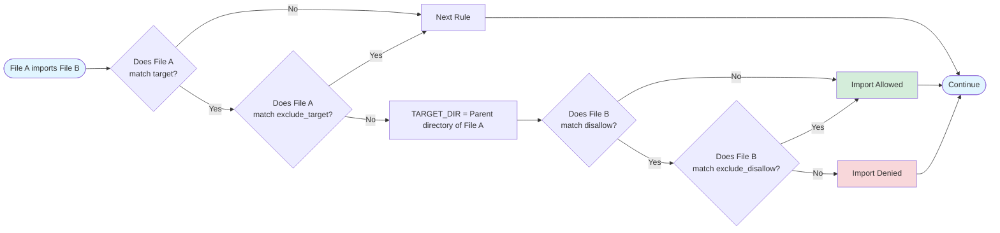

# Rules file specification

The rules are defined either in a part of `analysis_options.yaml` or in a dedicated `import_rules.yaml` within the project root. A rules file would look like the following:

```yaml
# import_rules.yaml

rules:
  # Rule 1
  - target: lib/domain/**
    disallow: lib/**
    exclude_disallow: lib/domain/**
    reason: Domain layer should not depend on other layers.

  # Rule 2
  - target: lib/persistence/**
    disallow:
      - lib/application/**
      - lib/presentation/**
    reason: Persistence layer can not depend on application and presentation layers.
```

Note that if rules are defined in `analysis_options.yaml`, ensure that all the top-level fields such as `rules` are declared in the `import_rules:` section.

```yaml
# analysis_options.yaml

plugins:
 import_rules: ^x.x.x

import_rules:
  rules:
    ...
```

## Top level fields

Here are the descriptions of the top level fields in the rules file:

| Field | Required | Description |
|-------|----------|-------------|
| `rules` | **Required** | List of [import rule](#import-rule) definitions. |

</br>

## Import rule

An import rule defines which files can import which other files. Each rule is evaluated independently in the definition order. See [How Rules Are Evaluated](#how-rules-are-evaluated) section for more details about the evaluation logic.

| Field             | Required   | Description |
|-------------------|------------|-------------|
| `reason`          | **Required** | Human-readable explanation of why this rule exists. It will be displayed as a lint error message when the rule is violated in the IDE or in the output of `dart analyze`. All leading/trailing whitespaces are removed, and newline characters in the middle are replaced with whitespaces. |
| `target`          | **Required** | A list of [target pattern](#target-pattern)s. If any of the patterns in the list matches the path of a Dart file in the project, the rule is applied to that file and such file is called a **target file**. </br></br> If the list contains only one pattern, it can be specified as a single string instead of a list: `target: lib/**`. |
| `exclude_target`  | Optional   | A list of [target pattern](#target-pattern)s. If the target file matches any of the patterns in the list, the rule is not applied to that file. </br></br> If the list contains only one pattern, it can be specified as a single string instead of a list: `exclude_target: lib/domain/**`. |
| `disallow`        | **Required** | A list of [disallow pattern](#disallow-pattern)s. The plugin tests each of the specified patterns one by one against an import directive of the target file (called an **importee**), and if any of the patterns matches, the plugin reports a rule violation error with the `reason` at that line in the target file. </br></br> If the list contains only one pattern, it can be specified as a single string instead of a list: `disallow: lib/**`. |
| `exclude_disallow`| Optional   | A list of [disallow pattern](#disallow-pattern)s. If the importee was matched any of the `disallow` patterns, but also matched any of the `exclude_disallow` patterns, the target file is exceptioinally allowed to import that importee and no error is reported. </br></br> If the list contains only one pattern, it can be specified as a single string instead of a list: `exclude_disallow: lib/domain/**`. |

</br>

## Target pattern

A target pattern is a glob path pattern used to determine which files an import rule applies to. A path pattern must be relative to the project root, and can contain wildcards to match multiple files. See the documentation of [glob](https://pub.dev/packages/glob#syntax) package for more details about the wildcards.

```yaml
# Match a specific Dart file.
target: lib/src/utils.dart

# Match a specific test file.
target: test/widget_test.dart

# Match every file in the project.
target: "**"

# Match all files in "domain" directory.
target: lib/domain/**

# Match all files in "src" directory under any directory, e.g.,
#   - lib/src/utils.dart
#   - lib/domain/src/utils.dart
#   - lib/features/auth/src/common/utils.dart
#
# Note that this doesn't match the top level "src" directory.
target: "**/src/**"

# Match all files with the prefix of "_".
target: _*.dart
```

</br>

## Disallow pattern

A disallow pattern is a [glob](https://pub.dev/packages/glob#syntax) based URI pattern that is tested against import directives of Dart files. It is similar to target patterns, but it can also contain a scheme and [predefined variables](#predefined-variables).

The plugin normalizes import URIs and disallow patterns to make them format-agnostic:

1. **Current Package:** `package:<current_package>/path/to/file.dart` is normalized to `lib/path/to/file.dart`.
2. **Relative Paths:** Relative paths like `lib/foo.dart` remain unchanged.
3. **External Packages:** `package:<other_package>/...` and `dart:...` URIs remain unchanged.

This means a single pattern `lib/domain/**` will match both:

- `import 'lib/domain/user.dart'` (relative import)
- `import 'package:my_app/domain/user.dart'` (package import)

**Examples:**

```yaml
# Match any file in the lib folder (relative or package import)
disallow: lib/**

# Match a specific file
disallow: lib/main.dart

# Match any file from an external package
disallow: package:http/**

# Match any file from the Dart standard library
disallow: dart:io

# Match files based on the target file's location (see predefined variables below)
disallow: $TARGET_DIR/private/**
```

</br>

### Predefined variables

There are several predefined variables that can be referenced in a disallow pattern with the prefix of `$`. These variables are substituted with actual values at evaluation time. See [How Rules Are Evaluated](#how-rules-are-evaluated) section for more details.

| Variable | Description |
|----------|-------------|
| `TARGET_DIR` | The path of the target file's parent directory relative to the project root. For example, if the target file is `lib/domain/user.dart`, the pattern `$TARGET_DIR/**` expands to `lib/domain/**` at evaluation time. An example of using this variable can be found in [Case study: Implementation detail encapsulation](README.md#implementation-detail-encapsulation). |

</br>

## How Rules Are Evaluated

When you import a file, the plugin checks each rule in order. For each rule:

1. **Does the source file match `target`?** If no, skip this rule
2. **Does the source file match `exclude_target`?** If yes, skip this rule
3. **Extract `$TARGET_DIR`** from the source file's parent directory
4. **Does the import match `disallow`?** If no, allow the import
5. **Does the import match `exclude_disallow`?** If yes, allow the import
6. **Otherwise:** Report a violation with the rule's `reason`

**Visual diagram:**


```mermaid
flowchart LR
    Start([File A imports File B]) --> CheckTarget{Does File A<br/>match target?}
    CheckTarget -->|No| NextRule[Next Rule]
    CheckTarget -->|Yes| CheckExcludeTarget{Does File A<br/>match exclude_target?}
    CheckExcludeTarget -->|Yes| NextRule
    CheckExcludeTarget -->|No| ExtractTARGET_DIR[TARGET_DIR = Parent directory of File A]
    ExtractTARGET_DIR --> CheckDisallow{Does File B<br/>match disallow?}
    CheckDisallow -->|No| Allow[Import Allowed]
    CheckDisallow -->|Yes| CheckExcludeDisallow{Does File B<br/>match exclude_disallow?}
    CheckExcludeDisallow -->|Yes| Allow
    CheckExcludeDisallow -->|No| Deny[Import Denied]
    NextRule --> End([Continue])
    Allow --> End
    Deny --> End

    style Start fill:#e1f5ff
    style End fill:#e1f5ff
    style Allow fill:#d4edda
    style Deny fill:#f8d7da
```

### Multiple Rules

All rules are evaluated for every import. If **any** rule denies an import, it results in an error.

**Example:**

```yaml
rules:
    target: lib/domain/**
    disallow: lib/ui/**
    reason: Domain layer should not depend on UI

    target: lib/ui/**
    disallow: package:http/**
    reason: UI should not make direct network calls
```

A file in `lib/ui/` importing `package:http/http.dart` will be caught by the second rule, even if the first rule doesn't apply.
