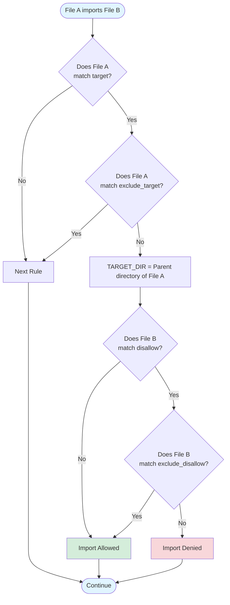

# Rules file specification

A rules file is a YAML file that contains a list of import rules. A rules file would look like the following:

```yaml
rules:
  # Rule 1
  - target: lib/domain/**
    disallow: lib/**
    exclude_disallow: lib/domain/**
    reason: Domain layer should not depend on other layers.

  # Rule 2
  - target: lib/persistence/**
    disallow:
      - lib/application/**
      - lib/presentation/**
    reason: Persistence layer can not depend on application and presentation layers.
```

Here are the descriptions of the top level fields. Note that if the rules are defined in `analysis_options.yaml`, ensure that all the top-level fields are declared in the `import_rules:` section.

```yaml
# analysis_options.yaml

import_rules:
  rules:
    ...
```

| Field | Required | Description |
|-------|----------|-------------|
| `rules` | **Required** | List of [import rule](#import-rule) definitions. |

## Import rule

An import rule defines which files can import which other files. Each rule is evaluated independently in the definition order. See [How Rules Are Evaluated](#how-rules-are-evaluated) section for more details about the evaluation logic.

| Field             | Required   | Description |
|-------------------|------------|-------------|
| `reason`          | **Required** | Human-readable explanation of why this rule exists. It will be displayed as a lint error message when the rule is violated in the IDE or in the output of `dart analyze`. All leading/trailing whitespaces are removed, and newline characters in the middle are replaced with a single whitespace. |
| `target`          | **Required** | A list of [target pattern](#target-pattern-syntax)s. If any of the patterns in the list matches the path of a Dart file in the project, the rule is applied to that file and such file is called a *target file*. If the list contains only one pattern, it can be specified as a single string instead of a list: `target: lib/**`. |
| `exclude_target`  | Optional   | A list of [target pattern](#target-pattern-syntax)s. If any of the patterns in the list matches the target file's path, the rule is not applied to that file. If the list contains only one pattern, it can be specified as a single string instead of a list: `exclude_target: lib/domain/**`. |
| `disallow`        | **Required** | A list of [disallow pattern](#disallow-pattern-syntax)s. The plugin tests each of import directives in the target file against the specified patterns one by one, and if any of the patterns matches the target import directive, the plugin reports an rule violation at that line in the target file. If the list contains only one pattern, it can be specified as a single string instead of a list: `disallow: lib/**`. |
| `exclude_disallow`| Optional   | A list of [disallow pattern](#disallow-pattern-syntax)s. If any of the patterns in the list matches the target import directive, the plugin reports an rule violation at that line in the target file. If the list contains only one pattern, it can be specified as a single string instead of a list: `exclude_disallow: lib/domain/**`. |

### Target pattern syntax

### Disallow pattern syntax

## Pattern Syntax

### Glob Patterns

Rules use glob patterns to match files. Patterns work with both relative file paths and package imports.

**Wildcards:**

| Pattern | Matches | Example |
|---------|---------|---------|
| `*` | Any characters within a single directory level | `lib/*.dart` matches `lib/main.dart` but not `lib/src/utils.dart` |
| `**` | Any number of directory levels | `lib/**` matches all files under `lib/` |
| `?` | Any single character | `lib/?.dart` matches `lib/a.dart`, `lib/b.dart` |

**Examples:**

```yaml
# Match all files in presentation layer
target: lib/presentation/**

# Match specific file types in any feature
target: lib/features/*/models/*.dart

# Match test files
target: test/**_test.dart

# Match external package imports
disallow: package:http/**

# Match Dart core libraries
disallow: dart:io
```

### The $TARGET_DIR Variable

`$TARGET_DIR` is a special variable that represents the parent directory of the file being checked. It enables directory-relative rules.

**Where to use it:**

- In `disallow` patterns
- In `exclude_disallow` patterns
- Cannot be used in `target` or `exclude_target`

**How it works:**

When a file matches `target`, `$TARGET_DIR` is set to that file's parent directory path.

**Example 1: Files can only import from their own directory**

```yaml
rules:
  - target: "**"
    disallow: "**/src/**"
    exclude_disallow: "$TARGET_DIR/**"
    reason: src/ files are implementation details, only importable within same directory
```

For file `lib/features/auth/src/utils.dart`:

- `$TARGET_DIR` becomes `lib/features/auth/src`
- Can import from `lib/features/auth/src/**` (same directory)
- Cannot import from `lib/features/profile/src/**` (different src directory)

**Example 2: Encapsulate implementation files**

```yaml
rules:
  - target: "**"
    disallow: "**/_*.dart"
    exclude_disallow: "$TARGET_DIR/_*.dart"
    reason: Files prefixed with underscore are private to their directory
```

For file `lib/cache/cache.dart`:

- `$TARGET_DIR` becomes `lib/cache`
- Can import `lib/cache/_internal.dart` (same directory)
- Cannot import `lib/utils/_helpers.dart` (different directory)

## How Rules Are Evaluated

When you import a file, the plugin checks each rule in order. For each rule:

1. **Does the source file match `target`?** If no, skip this rule
2. **Does the source file match `exclude_target`?** If yes, skip this rule
3. **Extract `$TARGET_DIR`** from the source file's parent directory
4. **Does the import match `disallow`?** If no, allow the import
5. **Does the import match `exclude_disallow`?** If yes, allow the import
6. **Otherwise:** Report a violation with the rule's `reason`

**Visual diagram:**


```mermaid
flowchart TD
    Start([File A imports File B]) --> CheckTarget{Does File A<br/>match target?}
    CheckTarget -->|No| NextRule[Next Rule]
    CheckTarget -->|Yes| CheckExcludeTarget{Does File A<br/>match exclude_target?}
    CheckExcludeTarget -->|Yes| NextRule
    CheckExcludeTarget -->|No| ExtractTARGET_DIR[TARGET_DIR = Parent directory of File A]
    ExtractTARGET_DIR --> CheckDisallow{Does File B<br/>match disallow?}
    CheckDisallow -->|No| Allow[Import Allowed]
    CheckDisallow -->|Yes| CheckExcludeDisallow{Does File B<br/>match exclude_disallow?}
    CheckExcludeDisallow -->|Yes| Allow
    CheckExcludeDisallow -->|No| Deny[Import Denied]
    NextRule --> End([Continue])
    Allow --> End
    Deny --> End

    style Start fill:#e1f5ff
    style End fill:#e1f5ff
    style Allow fill:#d4edda
    style Deny fill:#f8d7da
```

### Multiple Rules

All rules are evaluated for every import. If **any** rule denies an import, it results in an error.

**Example:**

```yaml
rules:
    target: lib/domain/**
    disallow: lib/ui/**
    reason: Domain layer should not depend on UI

    target: lib/ui/**
    disallow: package:http/**
    reason: UI should not make direct network calls
```

A file in `lib/ui/` importing `package:http/http.dart` will be caught by the second rule, even if the first rule doesn't apply.
